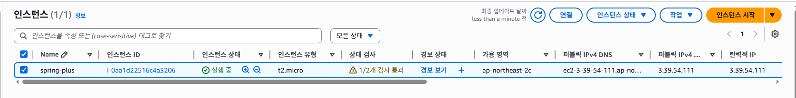
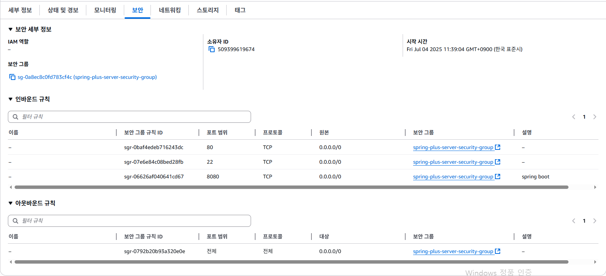
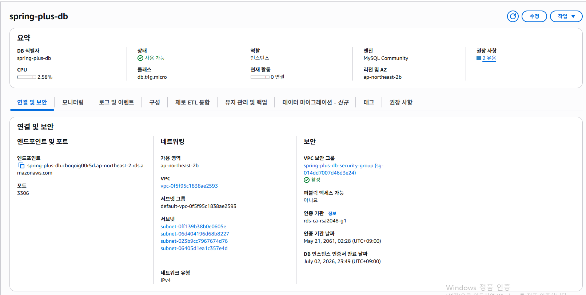
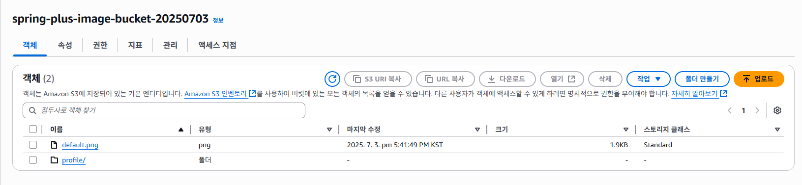

# SPRING PLUS

## 🛠 사용 기술
| 분야             | 기술 스택                                                                       |
|----------------|-----------------------------------------------------------------------------|
| **Language**   | Java 17                                                                     |
| **Build Tool** | Gradle 8.10                                                                 |
| **Framework**  | Spring Boot 3.3.3, Spring Data JPA (Hibernate 6.5.2.Final), Spring Security |
| **Database**   | MySQL 8.0+                                                     |
| **ORM**        | JPA, QueryDSL 5.0.0 (jakarta 기반)                                                         |
| **Infra**      | AWS EC2, RDS (MySQL), S3 (이미지 업로드)                                  |
| **Testing**    | JUnit5, Spring Boot Test                                                    |
| **Auth**       | JWT (JJWT 0.11.5), Bcrypt (at.favre.lib:bcrypt:0.10.2)                                                    |
| **Others**    | Lombok, Validation (javax validation), AWS Spring Cloud Starter (2.4.4), QueryDSL APT 설정                                                    |

<hr>

## 📝 단계별 요구사항

### Level. 1
1. 코드 개선 퀴즈 - @Transactional의 이해
2. 코드 추가 퀴즈 - JWT의 이해
3. 코드 개선 퀴즈 -  JPA의 이해
4. 테스트 코드 퀴즈 - 컨트롤러 테스트의 이해
5. 코드 개선 퀴즈 - AOP의 이해

### Level. 2
6. JPA Cascade
7. N+1
8. QueryDSL
9. Spring Security

### Level. 3
10. QueryDSL 을 사용하여 검색 기능 만들기
11. Transaction 심화
12. AWS 활용
13. 대용량 데이터 처리

<hr>

## 환경 변수 설정
프로젝트 루트 패키지에 .env 파일을 생성합니다.

```bash
# MYSQL 설정
MYSQL_USERNAME=your_mysql_username
MYSQL_PASSWORD=your_mysql_password
MYSQL_PORT=3306
MYSQL_DBNAME=spring_plus
MYSQL_HOST=your-rds-endpoint.rds.amazonaws.com

# 서버 포트
SERVER_PORT=8080

# JWT 설정
JWT_SECRET_KEY=your_jwt_secret_key

# AWS S3 설정
AWS_ACCESS_KEY=your_aws_access_key
AWS_SECRET_KEY=your_aws_secret_key
AWS_REGION=ap-northeast-2
S3_BUCKET_NAME=your-s3-bucket-name

# 기본 프로필 이미지
DEFAULT_PROFILE_IMAGE_URL=https://your-bucket-name.s3.ap-northeast-2.amazonaws.com/default.png
```

<hr>

## AWS 인프라 구성 요약
### EC2
- 탄력적 IP: `3.39.54.111`
- 보안 그룹: `8080`, `22`, `80` 허용
- [✔️] health check API: [http://3.39.54.111:8080/health](http://3.39.54.111:8080/health)
  (현재는 EC2 서버를 꺼놓은 상태입니다.)




### RDS
- 엔드포인트: `spring-plus-db.cboqoig00r5d.ap-northeast-2.rds.amazonaws.com`
- MySQL 8.0 / 포트 3306
- EC2에서 연결 허용



### S3
- 버킷 이름: `spring-plus-image-bucket-20250703`
- 프로필 이미지 수정 API:
  - `POST /users/profile`
- 프로필 이미지 삭제 API:
  - `DELETE /users/profile`



- 버킷 정책
```bash
{
    "Version": "2012-10-17",
    "Statement": [
        {
            "Sid": "Statement1",
            "Effect": "Allow",
            "Principal": "*",
            "Action": "s3:GetObject",
            "Resource": "arn:aws:s3:::spring-plus-image-bucket-20250703/*"
        },
        {
            "Sid": "AllowAppUploads",
            "Effect": "Allow",
            "Principal": {
                "AWS": "arn:aws:iam::509399619674:user/kimdogyun"
            },
            "Action": [
                "s3:PutObject",
                "s3:DeleteObject"
            ],
            "Resource": "arn:aws:s3:::spring-plus-image-bucket-20250703/*"
        }
    ]
}
```